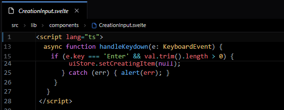

# @bhsd/codemirror-stickyscroll

> VS Code / Monaco-style **sticky scroll** (sticky lines) for [CodeMirror 6](https://codemirror.net/).

<p align="center">
  
</p>

This is a fork of [@fazelstudio/codemirror-stickyscroll](https://github.com/fazel-studio/codemirror-stickyscroll).

Sticky lines keep the *opening* lines of the enclosing scopes (function, class,
if/loop blocks, …) pinned at the top of the editor while you scroll — exactly
like VS Code's sticky scroll, but built **purely as an external CodeMirror 6
extension** (no fork of `@codemirror/*`).

## Features

- **Per-pixel updates** — a native `scroll` listener + `requestAnimationFrame`
  throttle keeps the bar glued to the scroll position; no "jumpy" updates.
- **Slide-away effect** — the innermost pinned line is pushed out gradually as
  its own closing line approaches the top of the viewport (Monaco behavior).
- **Click-to-jump with margin compensation** — clicking a sticky line scrolls
  the target line to the top *plus* the current bar height, so the line you
  jump to is never hidden behind the bar. Keyboard (`Enter`/`Space`) + `role="button"` for a11y.
- **Reuses the consumer's theme** — the bar re-highlights lines through the
  *active* highlight styles of the editor (`highlightingFor`), or clones the
  already-rendered DOM line when available. The package **never** registers its
  own `syntaxHighlighting(...)`.
- **Language-agnostic** — detection is based on `foldable()` from
  `@codemirror/language` (the fold services / fold node props that every
  `@codemirror/lang-*` already registers). It includes a smart, generic denylist
  that works across multiple languages (JS/TS, Python, Rust, Go, etc.) out of the box,
  and gracefully handles data languages like JSON.
- **Gutter alignment, horizontal sync, RTL, resize-proof** — line numbers are
  aligned with the real gutter (width tracked via `ResizeObserver`), the bar
  follows horizontal scroll, and it reacts to font/zoom/resize changes.
- **Zero runtime deps** — peer dependencies only.

## Installation

```bash
npm install @bhsd/codemirror-stickyscroll
```

The following are **peer dependencies** (already present in any project that
has a working CodeMirror 6 editor):

| Package | Minimum |
| --- | --- |
| `@codemirror/view` | ^6.0.0 |
| `@codemirror/state` | ^6.0.0 |
| `@codemirror/language` | ^6.0.0 |
| `@lezer/common` | ^1.0.0 |
| `@lezer/highlight` | ^1.0.0 |

## API

### `stickyScroll(options?: StickyScrollOptions): Extension`

```ts
interface StickyScrollOptions {
  /** Maximum sticky lines shown at once (dynamically clamped to ~40% of editor height). Default: 4 */
  maxStickyLines?: number;
  /** Minimum lines a scope must span to become sticky. Default: 2 */
  minBlockLines?: number;
  /**
   * Denylist predicate: return true to never pin a foldable node of that type.
   * Defaults to `defaultExcludeNode` (imports + data literals + comments).
   * It uses exact node names for JS/TS and generic regex patterns for other
   * languages, while automatically bypassing the literal denylist for JSON.
   */
  excludeNode?: (nodeName: string, langName: string | undefined) => boolean;
  /** Extra HighlightStyle merged in when a line is re-highlighted from scratch. */
  highlightStyle?: HighlightStyle;
  /** Called after a sticky line is clicked (after the jump is dispatched). */
  onLineClick?: (lineNumber: number) => void;
  /** Extra CSS class(es) for the bar container. */
  class?: string;
}
```

### Re-exports

```ts
import {
  stickyScroll,
  stickyScrollFacet,        // the configuration Facet (compose/override per instance)
  defaultExcludeNode,       // default denylist implementation
  makeStickyScrollConfig,   // merge options with defaults
  stickyScrollBaseTheme,    // layout-only base theme (no token colors)
  type StickyScrollOptions,
  type StickyLine,
} from "@bhsd/codemirror-stickyscroll";
```

## Styling

The bar is layout-only by default and always follows the **editor's own theme**
(token colors, background). You can restyle it with CSS:

```css
.cm-stickyscroll-container {
  /* bar background (auto-set from the editor theme; override if you like) */
  --cm-stickyscroll-bg: #1e1e1e;
}
```

Per-row hooks:

| Class | Purpose |
| --- | --- |
| `.cm-stickyscroll-container` | the overlay bar |
| `.cm-stickyscroll-line` | one breadcrumb row |
| `.cm-stickyscroll-line:hover` | hover highlight |
| `.cm-stickyscroll-line.cm-stickyscroll-current` | block containing the cursor |
| `.cm-stickyscroll-gutter` | line-number cell |
| `.cm-stickyscroll-text` | code column (horizontally synced) |

## How it works

1. **Detect the top line** — `view.lineBlockAtHeight(scrollTop - documentTop)`.
2. **Walk the syntax tree** — from `syntaxTree(state).resolveInner(topPos, 0)`
   up through `node.parent`.
3. **A scope qualifies when** its opening line is *foldable*
   (`foldable(state, line.from, line.to)` from `@codemirror/language`), its fold
   anchor node is not denylisted, and it spans ≥ `minBlockLines`.
4. **Render** — a `ViewPlugin` owns an absolutely-positioned overlay
   (`position: absolute; top: 0` inside `view.dom`), updated per-frame from the
   native `scroll` event; line numbers align with the real gutter; token colors
   come from the consumer's active highlighters.
5. **Slide-away** — when the innermost pinned block's closing line reaches the
   top, the bar's height shrinks and the innermost row(s) translate up & fade
   instead of disappearing abruptly.

The DOM overlay (rather than the Panel API / `showPanel`) is what makes the bar
behave like Monaco: it never pushes the content down (no reflow) and it can be
updated per-pixel, which panels cannot (panels only re-render on `ViewUpdate`,
not on pure scroll).

## Language support

Works out of the box with any `@codemirror/lang-*` (or community grammar) that
registers folding — JS/TS, Rust, Python, Java, Go, C#, etc.

## License

MIT — © Zulfazli (Fazelllyyy) · [https://github.com/fazelllyyy](https://github.com/fazelllyyy)
